# 데이터 모델 — ERD & Enum

> 원본: `vivacapi/models/*.py`. 모델이 바뀌면 이 문서도 함께 갱신한다.
> 모든 도메인 테이블의 PK는 shortuuid 22자 문자열(`VARCHAR(22)`)이며 `^[0-9A-Za-z]{22}$` CHECK 제약이 걸려 있다 (`audit_log`만 예외, `BIGSERIAL`).

## 1. ERD

```mermaid
erDiagram
    users {
        VARCHAR(22) uid PK "shortuuid"
        VARCHAR(320) email UK "unique + lower(email) unique index"
        VARCHAR(255) google_sub UK "unique, indexed"
        VARCHAR(50) nickname UK "unique, indexed, 자동 생성"
        VARCHAR(100) name "nullable"
        VARCHAR(2048) picture "nullable"
        BOOLEAN is_active "default: true"
        BOOLEAN is_staff "default: false"
        staff_role staff_role "enum: staff/manager/superuser"
        membership_tier membership_tier "enum: free/member"
        VARCHAR(22) referred_by_uid FK "nullable, 신규가입 1회만 세팅"
        TIMESTAMPTZ identity_verified_at "nullable"
        TIMESTAMPTZ onboarding_survey_completed_at "nullable"
        TIMESTAMPTZ created_at "server_default: now()"
        TIMESTAMPTZ updated_at "server_default: now(), onupdate"
    }

    spots {
        VARCHAR(22) uid PK "shortuuid"
        VARCHAR source "nullable, indexed"
        VARCHAR external_id "nullable, UNIQUE(source, external_id)"
        VARCHAR title "indexed"
        VARCHAR address "nullable"
        VARCHAR address_detail "nullable"
        VARCHAR region_province "nullable, indexed"
        VARCHAR region_city "nullable, indexed"
        VARCHAR postal_code "nullable"
        VARCHAR phone "nullable"
        VARCHAR description "nullable"
        VARCHAR tagline "nullable"
        FLOAT latitude "nullable"
        FLOAT longitude "nullable"
        FLOAT altitude "nullable"
        INTEGER unit_count "nullable"
        BOOLEAN is_fee_required "nullable"
        BOOLEAN is_pet_allowed "nullable"
        VARCHAR pet_policy "nullable"
        VARCHAR[] has_equipment_rental "nullable, ARRAY, 화이트리스트 관리"
        VARCHAR[] themes "nullable, ARRAY"
        VARCHAR fire_pit_type "nullable"
        VARCHAR[] amenities "nullable, ARRAY, 화이트리스트 관리"
        VARCHAR[] nearby_facilities "nullable, ARRAY, 화이트리스트 관리"
        VARCHAR camp_sight_type "nullable"
        FLOAT rating_avg "indexed"
        INTEGER review_count
        VARCHAR pipeline_status "CHECK: RAW..REJECTED, default RAW"
        SMALLINT trust_tier "nullable, CHECK 1-3"
        TIMESTAMPTZ last_verified_at "nullable, trust_tier 신선도 기준"
        VARCHAR website_url "nullable"
        VARCHAR booking_url "nullable"
        VARCHAR features "nullable"
        VARCHAR[] category "nullable, ARRAY, 화이트리스트 관리"
        FLOAT total_area_m2 "nullable"
        BOOLEAN has_liability_insurance "nullable"
        VARCHAR(22) assigned_to_uid FK "nullable, indexed, ON DELETE SET NULL"
        BOOLEAN is_deleted "soft delete"
        TIMESTAMPTZ created_at "server_default: now()"
        TIMESTAMPTZ updated_at "server_default: now(), onupdate"
    }

    spot_business_info {
        VARCHAR(22) uid PK "shortuuid"
        VARCHAR(22) spot_uid FK "UNIQUE (1:1), ON DELETE CASCADE"
        VARCHAR business_reg_no "nullable"
        VARCHAR tourism_business_reg_no "nullable"
        VARCHAR business_type "nullable"
        VARCHAR operation_type "nullable"
        VARCHAR operating_agency "nullable"
        VARCHAR operating_status "nullable, indexed"
        INTEGER national_park_no "nullable"
        VARCHAR national_park_office_code "nullable"
        VARCHAR national_park_serial_no "nullable"
        VARCHAR national_park_category_code "nullable"
        DATE licensed_at "nullable"
        TIMESTAMPTZ created_at "server_default: now()"
        TIMESTAMPTZ updated_at "server_default: now(), onupdate"
    }

    spot_reviews {
        VARCHAR(22) uid PK "shortuuid"
        VARCHAR(22) spot_uid FK "indexed"
        VARCHAR(22) user_id FK "indexed"
        FLOAT rating "NOT NULL, CHECK 0-5"
        VARCHAR content "nullable"
        TIMESTAMPTZ created_at "server_default: now()"
        TIMESTAMPTZ updated_at "server_default: now(), onupdate"
    }

    spot_review_reports {
        VARCHAR(22) uid PK "shortuuid"
        VARCHAR(22) review_uid FK
        VARCHAR(22) reporter_uid FK
        VARCHAR reason "nullable"
        TIMESTAMPTZ created_at "server_default: now()"
    }

    spot_images {
        VARCHAR(22) uid PK "shortuuid"
        VARCHAR(22) spot_uid FK "indexed"
        VARCHAR s3_key "NOT NULL, S3 객체 키만 저장"
        spot_image_role role "enum: thumbnail/detail"
        INTEGER sort_order "default: 0"
        BOOLEAN is_public "default: true — 서빙 방식 구분(CDN/presigned), 접근 제어 아님"
        VARCHAR content_type "nullable"
        TIMESTAMPTZ created_at "server_default: now()"
        TIMESTAMPTZ updated_at "server_default: now(), onupdate"
    }

    spot_groups {
        VARCHAR(22) uid PK "shortuuid"
        VARCHAR name
        VARCHAR description "nullable"
        group_visibility visibility "enum: private/invite_only/public"
        TIMESTAMPTZ created_at
        TIMESTAMPTZ updated_at
    }

    spot_group_members {
        VARCHAR(22) group_uid FK
        VARCHAR(22) user_uid FK
        group_role role "enum: viewer/contributor/editor/owner"
        VARCHAR(22) invited_by_uid "nullable, FK users.uid"
        TIMESTAMPTZ created_at
    }

    spot_group_spots {
        VARCHAR(22) group_uid FK
        VARCHAR(22) spot_uid FK
        TIMESTAMPTZ created_at
    }

    invites {
        VARCHAR(22) uid PK "shortuuid, 공유 링크 토큰 겸용"
        VARCHAR(22) inviter_uid FK
        VARCHAR(22) group_uid FK "nullable, ON DELETE CASCADE — null이면 일반 리퍼럴"
        group_role group_role "nullable, group_uid 있을 때만"
        invite_status status "enum: pending/accepted/revoked"
        VARCHAR(22) accepted_by_uid FK "nullable"
        TIMESTAMPTZ accepted_at "nullable"
        TIMESTAMPTZ created_at
    }

    spot_field_options {
        VARCHAR(22) uid PK "shortuuid"
        spot_option_field field "enum: category/amenities/nearby_facilities/has_equipment_rental"
        VARCHAR value
        TIMESTAMPTZ created_at
    }

    jobs {
        VARCHAR(22) uid PK "shortuuid"
        job_type type "enum: spots_bulk_upsert 등"
        job_status status "enum: pending/running/succeeded/failed, indexed"
        JSONB payload "NOT NULL"
        JSONB result "nullable"
        TEXT error "nullable, 실패 시 traceback"
        VARCHAR(22) created_by FK "NOT NULL"
        TIMESTAMPTZ created_at "server_default: now(), indexed"
        TIMESTAMPTZ started_at "nullable"
        TIMESTAMPTZ finished_at "nullable"
    }

    audit_log {
        BIGSERIAL id PK
        TEXT table_name "NOT NULL"
        TEXT row_uid "NOT NULL"
        TEXT action "INSERT/UPDATE/DELETE"
        JSONB old_data "nullable"
        JSONB new_data "nullable"
        TEXT changed_by "nullable, set_config('app.user_id')"
        TIMESTAMPTZ changed_at "NOT NULL, default now()"
    }

    spots ||--o| spot_business_info : "has business info (1:1)"
    spots ||--o{ spot_reviews : "has reviews"
    spots ||--o{ spot_images : "has images"
    spots }o--o{ spot_groups : "spot_group_spots 조인"
    users ||--o{ spot_reviews : "writes reviews"
    users ||--o{ spot_review_reports : "reports"
    users |o--o{ spots : "assigned_to (검증 담당)"
    users ||--o{ jobs : "creates"
    users }o--o{ spot_groups : "spot_group_members 조인"
    users ||--o{ invites : "발급(inviter)"
    users |o--o| users : "referred_by (리퍼럴 귀속)"
```

## 2. Relationships

| 관계 | 타입 | FK | 제약 조건 |
|---|---|---|---|
| `spots` → `spot_business_info` | 1:1 | `spot_business_info.spot_uid` → `spots.uid` | `UNIQUE(spot_uid)`, ON DELETE CASCADE |
| `spots` → `spot_reviews` | 1:N | `spot_reviews.spot_uid` → `spots.uid` | `UNIQUE(spot_uid, user_id)` — 유저당 스팟별 리뷰 1개 |
| `spots` → `spot_images` | 1:N | `spot_images.spot_uid` → `spots.uid` | - |
| `spots` ↔ `spot_groups` | N:M | `spot_group_spots` 조인 테이블 | - |
| `spot_groups` ↔ `users` | N:M | `spot_group_members` 조인 테이블 (role 포함) | - |
| `users` → `spot_reviews` | 1:N | `spot_reviews.user_id` → `users.uid` | - |
| `users` → `spots` | 1:N | `spots.assigned_to_uid` → `users.uid` | nullable, ON DELETE SET NULL |
| `users` → `jobs` | 1:N | `jobs.created_by` → `users.uid` | - |
| `users` → `invites` | 1:N | `invites.inviter_uid` → `users.uid` | - |
| `invites` → `spot_groups` | N:1 | `invites.group_uid` → `spot_groups.uid` | nullable, ON DELETE CASCADE |
| `users` → `users` | self-FK | `users.referred_by_uid` → `users.uid` | nullable, 신규가입 시 1회만 세팅, 이후 불변 |

`audit_log`는 FK 없이 `(table_name, row_uid)` 텍스트로 대상 행을 가리킨다 — 원본 행이 삭제돼도 이력이 남아야 하기 때문.

## 3. Constraints

| 테이블 | 이름 | 타입 | 설명 |
|---|---|---|---|
| 전 도메인 테이블 | `ck_<table>_uid_format` | CHECK | `uid ~ '^[0-9A-Za-z]{22}$'` (shortuuid 문자셋) |
| `users` | `ix_users_email_lower` | UNIQUE INDEX | `lower(email)` — 케이스만 다른 중복 계정 방지 |
| `spots` | `uq_spots_source_external_id` | UNIQUE | `(source, external_id)` — bulk upsert 키 |
| `spots` | `ck_spots_pipeline_status` | CHECK | `RAW`/`ENRICHED`/`CURATED`/`REVIEWED`/`PUBLISHED`/`REJECTED` |
| `spots` | `ck_spots_trust_tier` | CHECK | `trust_tier BETWEEN 1 AND 3` |
| `spot_reviews` | `uq_spot_user_review` | UNIQUE | `(spot_uid, user_id)` |
| `spot_reviews` | `check_review_rating_range` | CHECK | `rating >= 0 AND rating <= 5` |

## 4. Indexes

| 테이블 | 컬럼 | 용도 |
|---|---|---|
| `users` | `email`, `google_sub`, `nickname` | 로그인 매칭, 닉네임 중복 검사 |
| `spots` | `title`, `source`, `region_province`, `region_city`, `rating_avg`, `assigned_to_uid` | 검색/필터/정렬/My Queue |
| `spots` | `ix_spots_published_uid` (partial: `pipeline_status='PUBLISHED'`) | 공개 목록 커서 페이지네이션 |
| `spots` | `search_vector` (GIN, `tsvector`) + `title` (GIN, `pg_trgm`) | 탐색 검색, 상세는 [06-search.md](./06-search.md) |
| `spot_business_info` | `operating_status` | 운영 상태 필터 |
| `spot_reviews` | `spot_uid`, `user_id` | 스팟별/유저별 리뷰 조회 |
| `spot_images` | `spot_uid` | 스팟별 이미지 조회 |
| `jobs` | `status`, `created_at` | 워커 claim (PENDING 오래된 순) |
| `audit_log` | `(table_name, row_uid, changed_at)` | 행 단위 이력 조회 |

**알려진 인덱스 공백** (아직 미해결, [09-known-issues-and-tech-debt.md](./09-known-issues-and-tech-debt.md) 참고):

- `spots.pipeline_status`는 `PUBLISHED` partial index뿐 — 어드민이 `RAW`/`CURATED` 등으로 필터하면 seq scan.
- 어드민 목록의 `title ILIKE '%검색어%'`(선행 와일드카드)는 btree를 못 탄다.

## 5. Audit Triggers

`spots`, `spot_business_info`에 AFTER INSERT/UPDATE/DELETE 트리거(`log_audit()`)가 붙어 있어 변경 전/후 스냅샷을 `audit_log`에 기록한다. 변경 주체는 앱이 트랜잭션에서 `set_config('app.user_id', <uid>, true)`(SET LOCAL)로 주입한다(미주입 시 NULL). 라우터의 `crud_audit.set_audit_user`, 워커의 `process_job`이 이 주입을 담당한다. 새 테이블을 감사 대상에 추가하려면 트리거만 부착하면 된다 (`alembic/versions/b7f3a1c9d2e4` 참고).

`users` 테이블은 아직 감사 로그 대상이 아니다.

## 6. 전체 Enum 값

소스: `vivacapi/models/*.py`, `vivacapi/core/errors.py`. 값 자체가 DB/API에 저장되는 값이다.

### JobStatus (`models/job.py`)

| 값 | 의미 |
|---|---|
| `pending` | 대기 중, 아직 시작 안 함 |
| `running` | 실행 중 |
| `succeeded` | 성공 완료 |
| `failed` | 실패 |

### JobType (`models/job.py`)

| 값 | 의미 |
|---|---|
| `spots_bulk_upsert` | spot 대량 upsert |
| `spot_business_info_bulk_upsert` | spot 사업자 정보 대량 upsert |

### InviteStatus (`models/invite.py`)

| 값 | 의미 |
|---|---|
| `pending` | 대기 중, 미수락 (일반 리퍼럴은 수락 후에도 재사용을 위해 이 상태를 유지) |
| `accepted` | 수락됨 (그룹 초대만 이 상태로 전이, 1회용 종료) |
| `revoked` | 철회됨 (현재 발급 경로 없음, 향후 취소 기능용 예약) |

### MembershipTier (`models/user.py`)

| 값 | 의미 |
|---|---|
| `free` | 무료 회원 |
| `member` | 유료(정회원) |

### StaffRole (`models/user.py`)

`is_staff=True`인 사용자 내부의 세부 권한 등급. `STAFF < MANAGER < SUPERUSER` 순으로 권한 누적. `is_staff=False`면 의미 없음. 상세는 [03-auth-and-security.md](./03-auth-and-security.md).

| 값 | 의미 |
|---|---|
| `staff` | 기본 콘솔 접근 권한 |
| `manager` | staff 이상 — 검증 작업 할당, 그룹 삭제/멤버 역할 강제 변경 등 |
| `superuser` | 최상위 — spot bulk upsert(최대 5000행) 등 파괴적 작업 |

### SpotImageRole (`models/spot_image.py`)

| 값 | 의미 |
|---|---|
| `thumbnail` | 대표 이미지 |
| `detail` | 상세 이미지 |

### GroupVisibility (`models/spot_group.py`)

| 값 | 의미 |
|---|---|
| `private` | owner만 접근, 멤버 초대 불가 |
| `invite_only` | 멤버만 조회 가능(읽기 권한은 private와 동일), 멤버 초대는 허용 |
| `public` | 비로그인 포함 누구나 조회 가능 |

### GroupRole (`models/spot_group.py`)

`VIEWER < CONTRIBUTOR < EDITOR < OWNER` 순으로 권한 누적. 한 그룹에 OWNER가 여러 명일 수 있다(공동 소유).

| 값 | 의미 |
|---|---|
| `viewer` | 조회만 가능 |
| `contributor` | 콘텐츠 기여 가능 |
| `editor` | 편집 권한 |
| `owner` | 소유자, 그룹 관리 권한 |

### SpotOptionField (`models/spot_field_option.py`)

관리형 화이트리스트를 쓰는 `spots`의 배열 컬럼 이름. 값이 실제 컬럼명과 동일(코드에서 `getattr(Spot, field)`로 바로 매칭).

| 값 | 의미 |
|---|---|
| `category` | spot 카테고리 |
| `amenities` | 편의시설 |
| `nearby_facilities` | 주변 시설 |
| `has_equipment_rental` | 장비 대여 여부 관련 옵션 |

### PipelineStatus (`models/spot.py`)

`PUBLISHED`만 공개 API에 노출된다. 비즈니스 관점의 파이프라인 단계 정의는 [../business/04-data-pipeline-and-quality.md](../business/04-data-pipeline-and-quality.md) 참고.

| 값 | 단계 | 의미 |
|---|---|---|
| `RAW` | 원천 수집 | 크롤링/수집한 원본 그대로 (신규 row 기본값) |
| `ENRICHED` | 자동 보정 | 크롤링 기반 보정·병합 완료 |
| `CURATED` | 1차 수작업 | 사람이 정제·입력 완료 (검수 대기) |
| `REVIEWED` | 최종 검수 | 검수자 승인 완료 |
| `PUBLISHED` | 실 서비스 | production API에 노출 |
| `REJECTED` | 탈락 | 검수 반려, 중복, 폐쇄된 스팟 등 |

### ErrorCode (`core/errors.py`)

전역 에러 응답 봉투(`error.code`)에 쓰이는 코드. 상세는 [02-api-reference.md](./02-api-reference.md).

| 값 | HTTP status |
|---|---|
| `UNAUTHORIZED` | 401 |
| `FORBIDDEN` | 403 |
| `NOT_FOUND` | 404 |
| `USER_NOT_FOUND` | 404 |
| `JOB_NOT_FOUND` | 404 |
| `SPOT_NOT_FOUND` | 404 |
| `SPOT_BUSINESS_INFO_NOT_FOUND` | 404 |
| `SPOT_OPTION_NOT_FOUND` | 404 |
| `SPOT_OPTION_ALREADY_EXISTS` | 409 |
| `SPOT_GROUP_NOT_FOUND` | 404 |
| `SPOT_GROUP_MEMBER_NOT_FOUND` | 404 |
| `SPOT_GROUP_MEMBER_ALREADY_EXISTS` | 409 |
| `SPOT_GROUP_SPOT_ALREADY_EXISTS` | 409 |
| `SPOT_GROUP_LAST_OWNER_REQUIRED` | 409 |
| `SPOT_GROUP_INVITE_NOT_ALLOWED` | 403 |
| `REVIEW_NOT_FOUND` | 404 |
| `REVIEW_ALREADY_EXISTS` | 409 |
| `REVIEW_REPORT_ALREADY_EXISTS` | 409 |
| `INVITE_NOT_FOUND` | 404 |
| `INVITE_NOT_ACCEPTABLE` | 409 |
| `VALIDATION_ERROR` | 422 |
| `INTERNAL_ERROR` | 500 |
| `SERVICE_UNAVAILABLE` | 503 |
