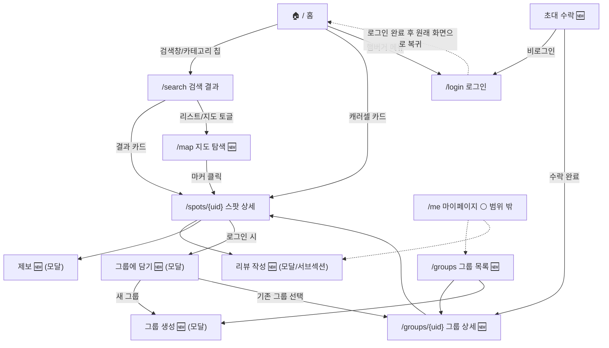

# VIVAC 정보 구조 (IA)

> 작성일: 2026-08-04
> 배경: [feature-spec.md](feature-spec.md)에서 정리한 화면(기존 4개 + 신규 8개)을 하나의 구조로 묶어, 화면 간 이동 경로와 내비게이션 뼈대를 명확히 한다. 화면별 상세 기능(정보구조·상태·데이터소스)은 여기서 다루지 않는다 — [feature-spec.md](feature-spec.md)를 참고.
> 범위: 웹 MVP 기준([PRODUCT.md](PRODUCT.md) "플랫폼" 참고). ✅ 표시는 실서비스에서 확인된 화면, 🆕는 feature-spec.md에서 신규 기획한 화면, ⚪는 이번 범위 밖(향후).

## 1. 사이트맵



## 2. 화면 인벤토리

| 화면 | 경로 | 깊이 | 로그인 | 진입 경로 | 상태 |
|---|---|---|---|---|---|
| 홈 | `/` | 0(진입점) | 불필요 | 직접 진입 | ✅ |
| 로그인 | `/login` | 1 | — | 홈 햄버거 메뉴, 로그인 필요 액션에서 유도 | ✅ |
| 검색 결과 | `/search` | 1 | 불필요 | 홈 검색창/카테고리 칩 | ✅ (검색창 Enter 미동작 버그 있음 — feature-spec §1.3) |
| 지도 탐색 | `/map` (또는 `/search` 뷰 토글) | 1~2 | 불필요 | 검색 결과 상단 토글 | 🆕 미구현 — feature-spec §4.1 |
| 스팟 상세 | `/spots/{uid}` | 2 | 불필요(열람) | 홈 캐러셀, 검색 결과, 지도 마커 | ✅ |
| 리뷰 작성 | (스팟 상세 내 모달/서브섹션, 별도 경로 불필요) | 3 | **필요** | 스팟 상세 "후기 작성" | 🆕 미구현 — feature-spec §3.2 |
| 제보 | (스팟 상세 내 모달) | 3 | 불필요(제보는 비로그인도 허용 검토) | 스팟 상세 "정보가 틀렸어요" | 🆕 미구현 — feature-spec §4.3 |
| 그룹에 담기 | (스팟 상세 내 모달) | 3 | **필요** | 스팟 상세 | 🆕 미구현 — feature-spec §3.1 |
| 그룹 목록 | `/groups` | 1 | **필요** | 홈 햄버거 메뉴(신설 필요) | 🆕 미구현 — feature-spec §3.1 |
| 그룹 상세 | `/groups/{uid}` | 2 | `PUBLIC`이면 불필요, `PRIVATE`면 필요 | 그룹 목록, 초대 수락, 스팟 상세 "그룹에 담기" | 🆕 미구현 — feature-spec §3.1 |
| 그룹 생성 | (모달) | 2 | **필요** | 그룹 목록 CTA, "그룹에 담기"에서 새 그룹 | 🆕 미구현 |
| 초대 수락 | 별도 경로(예: `/invites/{code}`) | 진입점(외부 링크로 유입) | 수락 시 필요 | 카카오톡/SNS 공유 링크 | 🆕 미구현 |
| 마이페이지 | `/me` | 1 | **필요** | 홈 햄버거 메뉴(신설 필요) | ⚪ 이번 범위 밖 — feature-spec §6 |

## 3. 내비게이션 구조

### 3.1 현재(실서비스 확인)

- **헤더**: 로고(홈 링크) + 햄버거 메뉴 아이콘만. 검색·카테고리는 헤더가 아니라 홈 본문에 있음(다른 화면에서는 검색 진입점이 안 보임 — 아래 3.3 참고).
- **햄버거 메뉴**: "홈", "로그아웃" 단 2개 항목. 그룹·마이페이지가 없으니 지금은 이걸로 충분하지만, §3.1·§4.1 화면이 생기면 메뉴 확장이 강제됨(아래 3.2).
- **하단 내비게이션**: 없음(모바일에서도 하단 탭 바 미사용, 스크롤형 단일 컬럼 구조).

### 3.2 신규 화면 추가 시 메뉴 확장 (제안)

그룹·마이페이지가 생기면 햄버거 메뉴 2개 항목으로는 부족합니다. 아래 구조를 제안합니다 — 확정 시 [feature-spec.md](feature-spec.md)에 반영하세요.

```
햄버거 메뉴
├─ 홈
├─ 검색 (현재 헤더에 진입점이 없어 추가 권장 — 3.3 참고)
├─ 내 그룹 🆕            (로그인 시만 노출)
├─ 마이페이지 🆕 ⚪      (로그인 시만 노출, 향후)
└─ 로그아웃 / 로그인
```

### 3.3 발견한 구조적 공백

- **검색 진입점이 홈에만 있다.** `/search`, `/spots/{uid}` 등 다른 화면에는 헤더에 검색창/링크가 없어, 검색하려면 항상 홈으로 돌아가야 함. 헤더에 검색 아이콘을 상시 노출하는 걸 권장(🔴 즉시 적용 가능, 별도 API 불필요).
- **로그인 후 복귀 위치 미확인.** 예: 스팟 상세에서 "그룹에 담기" 클릭 → 로그인 유도 → 로그인 완료 후 원래 스팟 상세로 돌아오는지, 홈으로 튕기는지 코드 확인 필요(🟠).
- **그룹·마이페이지가 생기기 전까지는 로그인 후 유저가 갈 곳이 사실상 없다.** 지금 로그인해도 홈 화면과 다를 게 없음 — §3.1(그룹)이 첫 "로그인 전용 목적지"가 됨. 우선순위 판단에 참고.

## 4. 아직 배치를 못 정한 것

- **제보("정보가 틀렸어요")의 로그인 요구 여부** — 팀 결정 필요. 스팸 방지 관점에서는 로그인 필요가 안전하나, 진입 장벽을 낮추려면 비로그인 허용 + 서버 측 rate limit이 대안(현재 `/v1/auth/*` rate limit 자체도 미구현 — STATUS.md §1 참고).
- **초대 수락 경로 형식** — `/invites/{code}` 같은 별도 라우트 vs 그룹 상세 페이지에 쿼리 파라미터로 흡수(`/groups/{uid}?invite={code}`) 중 택1. 백엔드는 `POST /v1/invites/{uid}/accept`만 정의돼 있어 프론트 라우팅은 자유롭게 설계 가능.
- **지도 탐색이 독립 라우트(`/map`)인지 검색 결과의 뷰 토글인지** — feature-spec.md §4.1에도 두 옵션이 나란히 제시돼 있음. IA 관점에서는 뷰 토글(검색 결과 안에서 리스트↔지도 전환) 쪽이 화면 depth를 하나 줄여 더 낫다고 판단되나, 확정은 아님.

---

관련 문서: [feature-spec.md](feature-spec.md)(화면별 상세 기능) · [PRODUCT.md](PRODUCT.md)(제품 정의) · [STATUS.md](STATUS.md)(진행상황)
