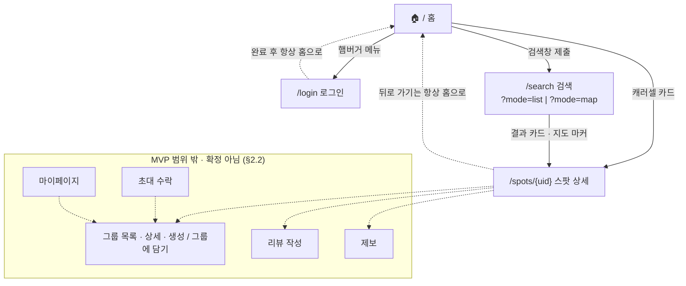

# VIVAC 정보 구조 (IA)

> 개정: 2026-08-10 (초판 2026-08-04)
> 담는 것: 사이트맵 · 화면 인벤토리 · 내비게이션 구조. 화면별 상세 기능은 [features/](features/README.md), 제품 정의·MVP 범위는 [PRODUCT.md](PRODUCT.md), 구현 현황 수치는 [STATUS.md](STATUS.md) §7이 담당한다 — 여기서 반복하지 않는다.
> 범위: 웹 + iOS 앱 MVP([PRODUCT.md](PRODUCT.md) §3.4). **IA 자체는 플랫폼 무관**이며 아래 구조는 양 플랫폼에 동일하게 적용된다.
> 초판의 화면 기획 배경은 archive된 [feature-spec](archive/planning-source/feature-spec-260804.md)에 있다(더 이상 갱신하지 않는 문서).

## 1. 사이트맵

실재하는 라우트는 4개다. 점선은 미확정 경로다.



## 2. 화면 인벤토리

### 2.1 MVP 화면

| 화면 | 경로 | 깊이 | 로그인 | 진입 경로 | 상세 |
|---|---|---|---|---|---|
| 홈 | `/` | 0(진입점) | 불필요 | 직접 진입 | [home.md](features/home.md) |
| 로그인 | `/login` | 1 | — | 햄버거 메뉴 | [auth.md](features/auth.md) |
| 검색 | `/search` | 1 | 불필요 | 홈 검색창, 검색 화면 자체 검색창 | [search.md](features/search.md) |
| 스팟 상세 | `/spots/{uid}` | 2 | 불필요(열람) | 홈 캐러셀, 검색 결과 카드·지도 마커 | [spot-detail.md](features/spot-detail.md) |

- **지도 탐색은 별도 라우트가 아니다.** `/search`의 2모드 확장(`?mode=list` | `?mode=map`)이며 기본 진입은 목록이다. 지도 모드는 데스크톱에서 리스트+지도 분할, 모바일에서 지도+스냅 바텀시트로 표현된다 — 치수·동작은 [search.md](features/search.md), 진행 상태는 [STATUS.md](STATUS.md) §7.5.
- **홈의 카테고리 칩은 진입 경로가 아니다.** 현재 비기능 요소로 렌더될 뿐 필터·검색으로 이어지지 않는다.
- `app/api/[...path]`·`app/api/auth/[...nextauth]`는 프록시·인증 핸들러이며 화면이 아니다.

### 2.2 MVP 범위 밖 · 확정 아님

아래는 **MVP에서 제외**됐고([PRODUCT.md](PRODUCT.md) §1.4), 중장기 후보로만 남아 있다([PRODUCT.md](PRODUCT.md) §7.5 — 확정된 계획이 아니며 상황에 따라 반영 여부를 그때 결정한다).
"미구현"이 아니라 **범위 밖**이다. 경로 표기는 전부 예시이며 확정된 것이 없다.

| 화면 | 예상 형태 | 로그인 | 화면 초안 |
|---|---|---|---|
| 그룹 목록 · 상세 · 생성 / 그룹에 담기 | `/groups`, `/groups/{uid}`, 스팟 상세 내 모달 | 필요(`PUBLIC` 그룹 열람은 예외) | archive된 [feature-spec](archive/planning-source/feature-spec-260804.md) 3.1 |
| 리뷰 작성 | 스팟 상세 내 모달/서브섹션 | 필요 | archive된 [feature-spec](archive/planning-source/feature-spec-260804.md) 3.2 |
| 제보 | 스팟 상세 내 모달 | 미정(§4) | archive된 [feature-spec](archive/planning-source/feature-spec-260804.md) 4.3 |
| 초대 수락 | 미정(§4) — 외부 공유 링크로 유입 | 수락 시 필요 | archive된 [feature-spec](archive/planning-source/feature-spec-260804.md) 3.1 |
| 마이페이지 | `/me` | 필요 | — |

## 3. 내비게이션 구조

### 3.1 현재

- **헤더**: 로고(홈 링크) + 햄버거 버튼. 검색·카테고리는 헤더가 아니라 본문에 있다.
- **햄버거 메뉴**: "홈" + (로그인 상태에 따라) "로그인" 또는 "로그아웃" 2개 항목.
- **스팟 상세는 전역 헤더를 쓰지 않는다.** 히어로 위에 얹히는 자체 탑바(뒤로 가기 + 공유하기)로 대체된다. `/login`도 전역 헤더가 없다.
- **하단 내비게이션**: 없음(모바일에서도 하단 탭 바 미사용, 스크롤형 단일 컬럼 구조).

### 3.2 §2.2 화면이 생길 경우의 메뉴 확장 (제안)

MVP 범위 밖 화면이 착수되면 2개 항목으로는 부족하다. 아래는 제안이며 확정이 아니다.

```
햄버거 메뉴
├─ 홈
├─ 검색 (스팟 상세에 진입점이 없어 추가 권장 — 3.3 참고)
├─ 내 그룹 ⚪            (로그인 시만 노출)
├─ 마이페이지 ⚪          (로그인 시만 노출)
└─ 로그아웃 / 로그인
```

### 3.3 발견한 구조적 공백

- **검색 진입점 — 부분 해소.** `/search`에 자체 검색창이 생겨 홈으로 돌아갈 필요가 없어졌다. 다만 **스팟 상세에는 여전히 검색 진입점이 없다** — 자체 탑바가 뒤로 가기·공유뿐이다.
- **스팟 상세의 뒤로 가기가 홈으로 고정돼 있다(🔴).** 검색 결과에서 들어와도 목록으로 돌아가지 못하고 홈으로 튕긴다. 진입 경로를 보존하도록 고칠 필요가 있다.
- **로그인 후 복귀 위치 — 확인 완료(🟠).** 로그인·로그아웃 모두 완료 후 홈으로 고정 이동한다. 원래 화면 복귀는 미지원이며, 로그인 유도가 필요한 액션이 생기면 먼저 해결해야 한다.
- **로그인 전용 목적지가 없다.** 그룹·마이페이지가 MVP 범위 밖으로 확정돼(§2.2), MVP 기간 내내 로그인해도 비로그인과 갈 수 있는 곳이 같다.

## 4. 아직 배치를 못 정한 것

- **지도 탐색의 라우트 형태 — ✅ 해소.** 독립 라우트(`/map`) 안은 폐기되고 `/search`의 2모드 확장으로 확정됐다. 지도 SDK도 웹·앱 모두 네이버로 확정([PRODUCT.md](PRODUCT.md) §6 D14).
- **초대 수락 경로 형식** — 별도 라우트(`/invites/{code}`) vs 그룹 상세의 쿼리 파라미터 흡수(`/groups/{uid}?invite={code}`) 중 택1. 그룹이 MVP 범위 밖이라 **착수 시점으로 이월**한다. 백엔드는 `POST /v1/invites/{uid}/accept`만 정의돼 있어 프론트 라우팅은 자유롭다.
- **제보의 로그인 요구 여부** — UGC 전반이 MVP 범위 밖이므로, [PRODUCT.md](PRODUCT.md) §7.4의 UGC 방향 결정에 종속된다. 그 전까지 IA에서 배치를 확정하지 않는다.

---

관련 문서: [features/](features/README.md)(화면별 상세 기능) · [PRODUCT.md](PRODUCT.md)(제품 정의·범위) · [STATUS.md](STATUS.md)(구현 현황)
